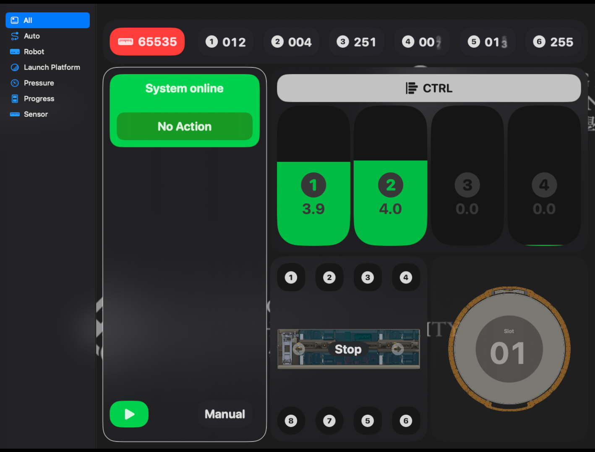

# CLP Inspection Robot Panel

Welcome to the CLP Inspection Robot Panel repository!

## Overview

The CLP Inspection Robot Panel is a software application designed to control and monitor inspection robots used in the CLP (Centralized Logistics Platform) system. This repository contains all the necessary code and documentation to set up and use the panel.

## Features

- Real-time monitoring of inspection robot status
- Control and navigation of inspection robots
- Data visualization and analysis
- User-friendly interface

## Installation

To install the CLP Inspection Robot Panel, follow these steps:

1. Clone this repository to your local machine.
2. Build the Application

## Usage

Once the CLP Inspection Robot Panel is installed, you can access it through a web browser. Simply open the application URL and log in with your credentials.

For more information on how to use the panel, please refer to the (not yet).

## License

This project is licensed under the [MIT License](./LICENSE).

## Contact